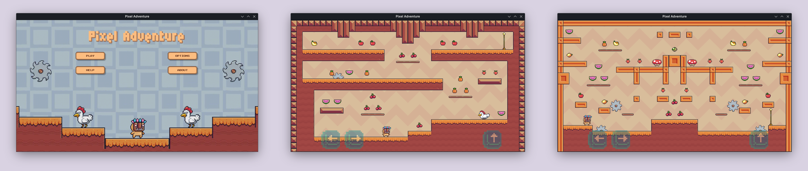

# 🎮 Pixel Adventure

A **2D Pixel Art Platformer Game** built with **Flutter** and powered by the **Flame game engine**.  
This project demonstrates how to build a game with **Flutter Flame** while managing state using **BLoC**.

## 🚀 Features

- 🌟 Classic 2D pixel art style
- 🎮 Smooth player movement and animations
- 🕹️ Platformer mechanics (jumping, obstacles, collectibles)
- ⚡ State management with **BLoC**
- 📱 Built entirely with **Flutter** (cross-platform mobile support)
- 🔥 Powered by the **Flame Engine**

## 🛠️ Tech Stack

- **Flutter** – Cross-platform framework
- **Flame** – Lightweight 2D game engine for Flutter
- **BLoC** – State management for game logic and UI
- **Dart** – Core programming language

## ▶️ Getting Started

### Prerequisites

- Flutter SDK installed → [Install Flutter](https://docs.flutter.dev/get-started/install)
- A device/emulator for testing

### Installation

```bash
# Clone the repository
git clone https://github.com/aayushshres/pixel-adventure.git

# Navigate to project folder
cd pixel-adventure

# Install dependencies
flutter pub get

# Run the app
flutter run
```

## 🎮 Controls

- Tap (button) – Move player
- Tap (button) – Jump

## 📸 Screenshots



## 🤝 Contribution

Contributions are welcome! Feel free to open issues and pull requests.
